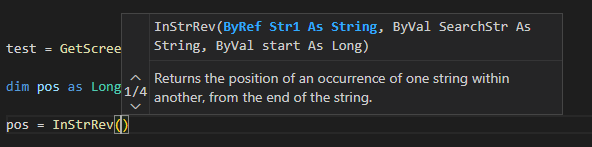

# Mach3 Script Extension für Visual Studio Code
Diese Erweiterung bietet Sprachunterstützung für Mach3 Script (CB Script) für [Visual Studio Code](https://code.visualstudio.com/).

<p align="center">
  <a href="./README.md">English</a> | 
  <span>Deutsch</span>
</p>

## Features
- Gliederung
- Autovervollständigung


- Gehe zu Definition
- Ausführen (kein Debugging)
- Hover


- Signaturen



- Farbinformationen anzeigen


- Zusätzliche M1S Funktions Bibliotheken als M1S Dateien einbinden
```
{ // settings.json
    "m1s.includes": ["c:\\mylibrary.m1s"]
}
```

## Mitarbeit
Du kannst dieses Projekt unterstützen, indem du die Quelldateien forkst und einen Pull Request/PR mit deinen Veränderungen erzeugst oder eine Issue mit deinem Problem/deiner Idee erzeugst.
- Vervollständigung der M1S Sprachdokumentation #21
- Übersetzung in weitere Sprachen
- ...


## Referenzen / Danksagung
Diese Erweiterung basiert auf VBScript Extension für Visual Studio Code von serpen.

