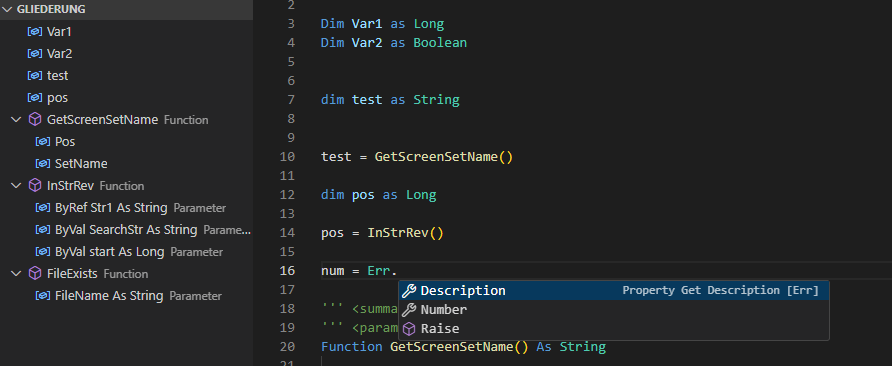
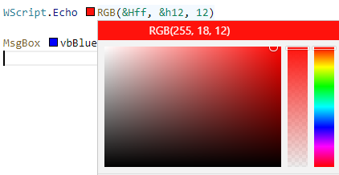

# Mach3 Script Extension for Visual Studio Code
This extension implements basic language features of Mach3 Script (CB Script) for [Visual Studio Code](https://code.visualstudio.com/).

<p align="center">
  <span>English</span> | 
  <a href="./README.de.md">Deutsch</a>
</p>

## Features
- Outline
- Completion


- Goto Definition
- Run (no debugging)
- Hover 


- Signatures


- Color Information



- Add extra M1S Source (libraries) files for extra completion
```
{ // settings.json
    "m1s.includes": ["c:\\mylibrary.m1s"]
}
```

## Contribute
You can support this project through PR with your changes or simply add an issue with your idea/bug.
- Complete Language Source Documentation #21
- Translate
- ...

## References / Thanks
This extension is based on the "VBScript Extension for Visual Studio Code" from serpen.
